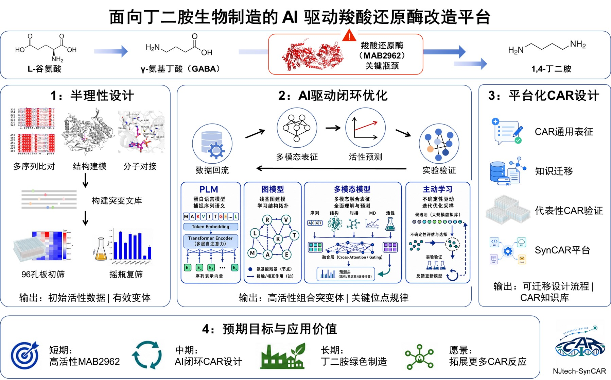

# Design · 设计方案

> 本页说明项目的设计逻辑、关键取舍和已完成验证的边界；实验步骤、模型实现与原始数据分别见对应页面。

---

## 1. 设计原则 / Design Principles

项目以 MAB2962 羧酸还原酶为对象，服务于 GABA—1,4-丁二胺路线中的酶工程候选比较。我们以 PSW（D281P/G420W/N514S）为后续候选的共同亲本，并遵循四项原则：

- **候选与证据分开记录。** 序列、结构和蛋白语言模型用于提出或排序候选；是否有效以湿实验结果为准。
- **按实验时间评价模型。** R0、R1、R2 按实际实验轮次划分，测试轮次不参与对应训练或模型选择。
- **按检测体系解释结果。** 快筛/复筛、纯酶活性和全细胞 1,4-丁二胺产物表现分别报告，不跨体系直接比较倍数。
- **保留可追溯入口。** 正式候选表、原始实验文件、两个元件和 benchmark 代码均在本提交区中定位。

## 2. 系统架构 / System Architecture



```text
PSW → ESM2 zero-shot 候选排序 → R0 实验
    → 用 R0 标签训练 RF / FCNN → R1 预测与实验
    → 将 R1 标签反馈训练 → R2 预测与实验
```

R0、R1、R2 的正式候选表位于 [`data/processed/`](../data/processed/)，相应原始筛选数据位于 [`data/raw/`](../data/raw/)。R0 最佳相对活性为 1.118；R1 为 1.554；R2 为 1.386。加入 R1 反馈后，FCNN 在同一 R2 测试集上的 Spearman 由 −0.040 提升至 0.118；这一改善仅适用于该模型、该时间划分和当前低样本体系。

Round 3 的五突变数据只用于高阶突变外推的 retrospective challenge，不进入上述训练、验证、模型选择或 DBTL 成功判定。

## 3. 关键技术决策 / Key Decisions

| 决策 | 选择 | 理由与证据边界 |
| --- | --- | --- |
| 候选生成 | 结合结构/序列线索、半理性突变与蛋白语言模型排序 | 在有限实验通量下确定优先级；模型分数不被直接解释为催化活性。 |
| 比较亲本 | 以 PSW 为后续候选的同批次对照，并保留野生型序列 | 区分新增突变在 PSW 背景中的效应与亲本效应。 |
| 正式实验标签 | round_1、round_2 以复筛结果相对同批次 PSW 的值为准 | 复筛用于降低初筛假阳性的影响；数据定义见 [Wet Lab](./Wet-Lab-Experiments.md)。 |
| 模型评估 | ESM2 zero-shot、固定 RF 与 FCNN 的时间前向 benchmark | R0→R1、R0→R2、R0+R1→R2 三种划分均报告；RF 为受 EvolvePro 思路启发的工程基线，不等同于原方法复现。 |
| 表征层次 | 快筛/复筛、纯酶与全细胞催化分层验证 | 两个元件均保留序列、元数据、质粒图和表征记录；不同体系的相对值不作等价换算。 |
| 高阶组合 | 将 Round 3 与正式 benchmark 隔离 | 避免将 retrospective challenge 混入训练证据或额外闭环成功主张。 |

## 4. 风险与缓解 / Risks & Mitigations

| 风险 | 已采取的处理 | 当前边界 |
| --- | --- | --- |
| 平行值缺失或重复性质未确认 | 如实保留 n；round_1 的 F430M 为 n=2，不补造第三个值 | 技术重复与生物学重复的类型未由现有文件确认。 |
| 训练与测试重叠 | 使用固定实验时间划分，并由正式 benchmark 限制可用训练轮次 | 结果仍只代表当前 MAB2962—GABA—PSW 数据范围。 |
| 筛选活性被过度外推 | 纯酶与全细胞结果分开报告，并保留原始/处理数据入口 | 未完成底物谱、放大、成本和环境评价。 |
| 模型结论被夸大 | 报告全部时间前向结果，说明 FCNN 改善不代表所有模型均改善 | 尚未完成公开数据集的系统验证或更多公开基线的完整比较。 |

## 5. 验证与可追溯性

| 设计环节 | 当前证据 | 核查入口 |
| --- | --- | --- |
| 候选排序与时间前向评估 | 三种模型、三种训练—测试划分的 Spearman 结果 | [AI / Computational Methods](./AI-Computational-Methods.md)；[`src/ai/historical_benchmark/`](../src/ai/historical_benchmark/) |
| R0—R2 实验反馈 | 正式候选表及每轮统计摘要 | [Integrated Validation](./Integrated-Validation.md)；[`data/processed/`](../data/processed/) |
| 元件表征 | PSW-F430M、PSW-L417A 的纯酶和全细胞数据 | [Parts](./Parts.md)；[`parts/`](../parts/) |
| 实验方法与重复信息 | 筛选、纯酶、全细胞流程和数据索引 | [Wet Lab / Experiments](./Wet-Lab-Experiments.md) |

复现入口为 `python src/ai/historical_benchmark/run_all.py`；运行需要该目录 README 所述的本地 ESM2-650M 缓存，程序不会联网下载权重。实际运行日志、缓存版本和输出哈希尚未作为提交证据归档，因此不将其表述为第三方复现已完成。

---

*最后更新：2026-09-10*
